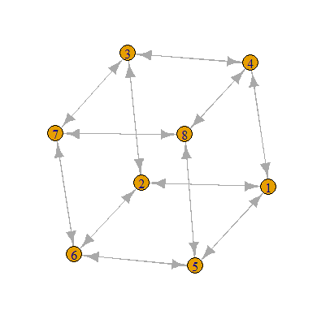
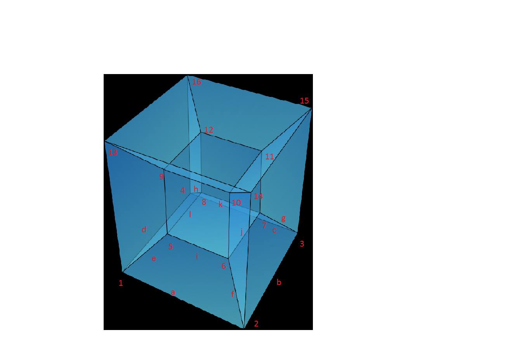

```{r setup, include=FALSE}
knitr::opts_chunk$set(echo = TRUE)
library(rgl)
library(scatterplot3d)
library(ggplot2)
library(animation)
library(plotly)
library(htmlwidgets)
library(igraph)
library(kableExtra)
library(dplyr)
```
# 1. Opis in programsko okolje

Ukvarjal sem se z naključnimi sprehodi na premici, ravnini in prostoru ter različnih družinah grafov z nekaterimi parametri (d-dimenzionalna mreža, neskončna d-pravilna drevesa, 2-pravilna drevesa višine d, d-dimenzionalna hiperkocka itd.). S simulacijo naključnih sprehodov se bomo sprehajali po takšnih objektih: simulirali bomo čas pokrivanja, čas zadetkov za ralična oglišča, število obiskov oglišč, itd.

Za simulacije in izračune sem uporabil programsko okolje R. 

# 2. Naključni sprehodi

Naj bo $X$ slučajna spremenljivka porazdeljena kot
\begin{equation} \label{eq:bernoulli}
X_t \sim \begin{pmatrix}
-1 & 1 \\
1-p & p
\end{pmatrix} 
\end{equation}
za $t=1,2, \ldots$, kjer je $p \in [0,1]$. Če je $p=\frac{1}{2}$, pravimo, 
da je naključni sprehod simetričen. Naključni sprehod sledi kumulativni vsoti
teh naključnih spremevljivk, kar lahko zapišemo kot 
\begin{equation} \label{eq:kumulativna_vsota}
S_t=\sum_{k=1}^tX_k,
\end{equation}
kjer je 
\[
S_0=0.
\]
Poglejmo si najprej naključen sprehod po celih številih. Iz verjetnosti vemo, da naključni sprehod spada med markovske procese. Naj bosta $a,b > 0, a,b \in \mathbb{N}$. Naj bo $b$ zgornja meja, $-a$ pa spodnja meja. Potem velja: 
\begin{equation} \label{eq:prej_b_kot_a}
P(S_t = b)=\begin{cases}
      \frac{a}{a+b} & \text{če je } p=\frac{1}{2}, \\
      \frac{1-(\frac{q}{p})^a}{1-(\frac{q}{p})^{a+b}} & \text{če je } p \neq \frac{1}{2}.
    \end{cases}       
\end{equation}
oziroma 
\begin{equation} \label{eq:prej_a_kot_b}
P(S_t = -a)=\begin{cases}
      \frac{b}{a+b} & \text{če je } p=\frac{1}{2}, \\
      \frac{1-(\frac{q}{p})^b}{1-(\frac{q}{p})^{a+b}} & \text{če je } p \neq \frac{1}{2}.
    \end{cases}       
\end{equation}

Za stanje $X$ rečemo, da je povrnljivo, če velja
\[
P_X(\hat{T_X}< \infty) = 1
\]
in minljivo, če velja
\[
P_X(\hat{T_X}< \infty) < 1.
\]


## 2.1 Simetrični naključni sprehodi

Poglejmo si najprej eno simulacijo simetričnega naključnega sprehoda, torej $p=\frac{1}{2}$. Da lahko dodamo še časovno komponento zarotirajmo os tako, da bo na abcisni osi čas, na ordinatni pa vrednost slučajnega sprehoda. Za spodnjo mejo si izberemo $-5$, za zgornjo pa $5$. 


```{r, echo=FALSE, fig.align="center"}
set.seed(77)
sim_sprehod <- function(p, spodnja_meja, zgornja_meja){
  vektor_vrednosti <- c(0)
  vsota <- 0
  spodaj <- 0 
  zgoraj <- 0
  while (vsota > spodnja_meja & vsota < zgornja_meja){
    c <- c(-1,1)
    a <- sample(c, 1)
    vsota <- vsota + a
    vektor_vrednosti <- c(vektor_vrednosti, vsota)
    if (a == -1){
      spodaj <- spodaj + a
    } else {
      zgoraj <- zgoraj + a
    }
  }
  vrednosti <- list(vektor_vrednosti, spodaj, zgoraj)
  return(vrednosti)
}
vektor_vrednosti <- c(0)
vsota <- 0
p = 0.50
spodnja_meja <- -5
zgornja_meja <- 5
seznam1 <- replicate(1, sim_sprehod(p, spodnja_meja, zgornja_meja))
max_length <- max(sapply(seznam1, length))

plot(c(1, max_length), c(spodnja_meja, zgornja_meja), type = "n",
     main="Random walk", xlab="cas oz. stevilo korakov", ylab="vrednost")
for (i in 1:1) {
  lines(1:length(seznam1[[i]]), seznam1[[i]])
}
abline(h = 0, lty = "dashed")
abline(h = spodnja_meja, lwd = 2)
abline(h = zgornja_meja, lwd = 2)
seznam1[[1]]
length(seznam1[[1]])
spodnja_meja <- -25
zgornja_meja <- 25
N <- 1000
```

S grafa razberemo, da smo prej dosegli spodnjo mejo in da smo za to potrebovali `r length(seznam1[[1]])` korakov. Simulirajmo sedaj `r N` sprehodov z zgornjo mejo `r zgornja_meja` in spodnjo mejo `r spodnja_meja`.

<center>
```{r, echo=FALSE}
colorPicker <- function(vsota, max_length,
                        ls_color = c(178, 34, 34), ll_color = c(255, 204, 0),
                        us_color = c(0, 0, 102), ul_color = c(102, 204, 225)) {
  l <- length(vsota)
  if (vsota[l] < 0) {
    rgb_values <- (ls_color + (ll_color - ls_color) * l / max_length) / 255
  } else {
    rgb_values <- (us_color + (ul_color - us_color) * l / max_length) / 255
  }
  rgb(rgb_values[1], rgb_values[2], rgb_values[3])
}

vektor_vrednosti <- c(0)
vsota <- 0
p = 0.50
spodnja_meja <- -25
zgornja_meja <- 25
a <- sim_sprehod(p,spodnja_meja,zgornja_meja)
N <- 10000
seznam <- replicate(N, sim_sprehod(p, spodnja_meja, zgornja_meja))
max_length <- max(sapply(seznam, length))
# make plot
plot(c(1, max_length), c(spodnja_meja, zgornja_meja), type = "n",
     main="Random walks", xlab="cas oz. stevilo korakov", ylab="vrednost")
for (i in 1:N) {
  lines(1:length(seznam[[i]]), seznam[[i]],
        col = colorPicker(seznam[[i]], max_length), lwd = 0.5)
}
abline(h = 0, lty = "dashed")
abline(h = spodnja_meja, lwd = 2)
abline(h = zgornja_meja, lwd = 2)
```
</center>

Zaradi velikega števila sprehodov so na zgornjem grafi sprehodi obarvani. Sprehodi, ki dosežejo zgornjo mejo, so obarvani z modro, ostali pa z oranžno. Simulacije sprehodov se med seboj razlikujejo tudi po intenzivnosti - tisti bolj temni prej dosežejo mejo, kot svetlejši. 

Poglejmo si verjetnost, da prej dosežemo zgornjo mejo - preverimo torej, če drži formula $P(S_t = b)$. 

```{r, echo=FALSE, fig.align="center"}
verjetnost_da_prej_dosezemo_zgornjo_mejo <- function(seznam){
  stevilo_sprehodov <- length(seznam)/3
  koncal_zgoraj <- 0
  for (i in seq(2, length(seznam), by = 3)) {
      if (abs(seznam[[i]]) - seznam[[i+1]] < 0){
        koncal_zgoraj <- koncal_zgoraj + 1 
      }
  }
  iskana_verjetnost <- koncal_zgoraj / stevilo_sprehodov
  return(iskana_verjetnost)
}
#narišimo verjetnost 

# stevilo simulacij: 
x <- c(1:N)
y <- c()
for (i in seq(3, length(seznam), by = 3)) {
  b <- seznam[1:i]
  p <- verjetnost_da_prej_dosezemo_zgornjo_mejo(b)
  y <- c(y,p)
}
y[length(y)]
vrednosti_verjetnosti <- data.frame(x,y)
plot(x,y,
     type="l", lwd=1, xlab="Število simulacij", ylab="Verjetnost")
abline(h = abs(spodnja_meja)/(abs(spodnja_meja)+zgornja_meja), lty = "dashed")
```


S 'pomočjo' grafa se lahko prepričamo, da zgornja formula $P(S_t = b)$ drži. Če je $p =\frac{1}{2}, -a = -25, b=25$ je verjetnost enaka $0.5$. Simulirana vrednost pa znaša `r y[length(y)]`. 


Poglejmo si še primer, ko sta $a$ in $b$ različna. Naj bo $-a=-17$ in $b=24$.  

```{r, echo=FALSE, fig.align="center"}

vektor_vrednosti <- c(0)
vsota <- 0
p = 0.50
spodnja_meja1 <- -17
zgornja_meja1 <- 24
a <- sim_sprehod(p,spodnja_meja1,zgornja_meja1)
M <- 10000
seznam1 <- replicate(M, sim_sprehod(p, spodnja_meja1, zgornja_meja1))
max_length1 <- max(sapply(seznam1, length))
# make plot
plot(c(1, max_length1), c(spodnja_meja1, zgornja_meja1), type = "n",
     main="Random walks", xlab="cas oz. stevilo korakov", ylab="vrednost")
for (i in 1:M) {
  lines(1:length(seznam1[[i]]), seznam1[[i]],
        col = colorPicker(seznam1[[i]], max_length1), lwd = 0.5)
}
abline(h = 0, lty = "dashed")
abline(h = spodnja_meja1, lwd = 2)
abline(h = zgornja_meja1, lwd = 2)
```

S zgornje slike opazimo, da je spodnja meja dosežena večkrat kot zgornja. To je povsem smiselno, saj je manj oddaljena od izhodišča. Formula nam pove, da je verjetnost, da prej dosežemo zgornjo mejo enaka $\frac{17}{17+24}=\frac{17}{41} \approx 0.4146341$.


```{r, echo=FALSE,fig.align="center"}

# stevilo simulacij: 
x <- c(1:M)
y <- c()
for (i in seq(3, length(seznam1), by = 3)) {
  b <- seznam1[1:i]
  p <- verjetnost_da_prej_dosezemo_zgornjo_mejo(b)
  y <- c(y,p)
}
vrednosti_verjetnosti <- data.frame(x,y)
plot(x,y,
     type="l", lwd=1, xlab="Število simulacij", ylab="Verjetnost")
abline(h = abs(spodnja_meja1)/(abs(spodnja_meja1)+zgornja_meja1), lty = "dashed")

y[length(y)]
```

Simulirana vrednost znaša `r y[length(y)]`, kar nam prikazuje slika.

## 2.2 Nesimetrični naključni sprehodi

Sem spadajo vsi naključni sprehodi katerih $p$ je različen od $\frac{1}{2}$. 

Poglejmo si simulacijo $10.000$ naključnih sprehodov, kjer je $p=\frac{3}{4}$. Za spodnjo mejo vzemimo $-4$, za zgornjo pa $36$.

```{r, echo=FALSE, fig.align="center"}
nesim_sprehod <- function(p_gor, spodnja_meja, zgornja_meja){
  vektor_vrednosti <- c(0)
  vsota <- 0
  spodaj <- 0 
  zgoraj <- 0
  while (vsota > spodnja_meja & vsota < zgornja_meja){
    #  ifelse(test, yes, no)
    a <- ifelse(runif(1) < p_gor, 1, -1)
    vsota <- vsota + a
    vektor_vrednosti <- c(vektor_vrednosti, vsota)
    if (a == -1){
      spodaj <- spodaj + a
    } else {
      zgoraj <- zgoraj + a
    }
  }
  vrednosti <- list(vektor_vrednosti, spodaj, zgoraj)
  return(vrednosti)
}

vektor_vrednosti_ne_sim <- c(0)
vsota_ne_sim <- 0
p_gor = 0.75
spodnja_meja_ne_sim <- -4
zgornja_meja_ne_sim <- 36
a <- nesim_sprehod(p_gor,spodnja_meja_ne_sim,zgornja_meja_ne_sim)
N <- 10000
set.seed(53)
seznam_ne_sim <- replicate(N, nesim_sprehod(p_gor,spodnja_meja_ne_sim,zgornja_meja_ne_sim))
max_length <- max(sapply(seznam_ne_sim, length))
# make plot
plot(c(1, max_length), c(spodnja_meja_ne_sim, zgornja_meja_ne_sim), type = "n",
     main="Random walks", xlab="cas oz. stevilo korakov", ylab="vrednost")
for (i in 1:N) {
  lines(1:length(seznam_ne_sim[[i]]), seznam_ne_sim[[i]],
        col = colorPicker(seznam_ne_sim[[i]], max_length), lwd = 0.5)
}
abline(h = 0, lty = "dashed")
abline(h = spodnja_meja_ne_sim, lwd = 2)
abline(h = zgornja_meja_ne_sim, lwd = 2)
```

Kolikokrat in v koliko korakih je bila meja dosežena, si bomo pogledali v naslednjem razdelku. Poglejmo si še verjetnost, da pri danem $p$-ju prej dosežemo zgornjo mejo. Formula nam da
\[
\frac{1-(\frac{q}{p})^a}{1-(\frac{q}{p})^{a+b}}=\frac{1-(\frac{0.25}{0.75})^4}{1-(\frac{0.25}{0.75})^{4+36}}=\frac{80}{81} \approx 0.98765.
\]


```{r, echo=FALSE}
prestej <- function(seznam_ne_sim, spodnja_meja_ne_sim, zgornja_meja_ne_sim){
  # je šel zgoraj in kok korakov je rabu
  zgoraj <- c()
  # je šel spodaj in kok korakov je rabu
  spodaj <- c()
  for (i in seq(1, length(seznam_ne_sim), by = 3)){
    pot <- seznam_ne_sim[[i]]
    pot
    stevilo_korakov <- abs(seznam_ne_sim[[i+1]])+ abs(seznam_ne_sim[[i+2]])
    stevilo_korakov
    if (pot[length(pot)]==zgornja_meja_ne_sim){
      zgoraj <- c(zgoraj,stevilo_korakov)
      zgoraj
    } else {
      spodaj <- c(spodaj,stevilo_korakov)
      spodaj
    }
  }
  vrednosti <- list(spodaj, zgoraj)
  return(vrednosti)
}

verjetnost_da_prej_dosezemo_zgornjo_mejo(seznam_ne_sim)

#narišimo verjetnost 


kolikokrat_dosezemo_zgornjo_mejo <- function(seznam_ne_sim, spodnja_meja_ne_sim, zgornja_meja_ne_sim){
  dosezena_zgornja <- 0
  for (i in seq(1, length(seznam_ne_sim), by = 3)){
    a <- length(seznam_ne_sim[[i]])
    b <- seznam_ne_sim[[i]]
    c <- b[a]
    if (c == zgornja_meja_ne_sim){
      dosezena_zgornja <- dosezena_zgornja +1
    }
  }
  return(dosezena_zgornja)
}

kolikokrat_dosezemo_zgornjo_mejo(seznam_ne_sim, spodnja_meja_ne_sim, zgornja_meja_ne_sim)


stevilo_korakov_ne_sim <- prestej(seznam_ne_sim, spodnja_meja_ne_sim, zgornja_meja_ne_sim)

#ttt_ne_sim <- table(stevilo_korakov_ne_sim[[1]])
#tttt_ne_sim <- table(stevilo_korakov_ne_sim[[2]])
#View(ttt_ne_sim)
#View(tttt_ne_sim)

# stevilo simulacij: 
x <- c(1:N)
y <- c()
for (i in seq(3, length(seznam_ne_sim), by = 3)) {
  b <- seznam_ne_sim[1:i]
  p <- verjetnost_da_prej_dosezemo_zgornjo_mejo(b)
  y <- c(y,p)
}
plot(x,y,
     type="l", lwd=1, xlab="Število simulacij", ylab="Verjetnost")
abline(h = (1-((1-p_gor)/(p_gor))^(abs(spodnja_meja_ne_sim)))/(1-((1-p_gor)/(p_gor))^(abs(spodnja_meja_ne_sim)+zgornja_meja_ne_sim)), 
       lty = "dashed")


```

S pomočjo simulacije dobimo `r y[length(y)]` kar je zelo dober približek. Iz vseh grafikonov je več kot očitno, da je stanje $0$ povrnljivo - prav tako so vsa stanja povrnljiva. 

# 3. Pričakovano število korakov zadetja meje

## 3.1 Simetrični sprehod

Naj bo $T = T_{-a} \wedge T_b$ čas ustavljanja, kjer sta $T_{-a}=\inf\{t \geq 0 | S_t = -a \}$ oziroma $T_b=\inf\{t \geq 0 | S_t = b \}$. Koliko korakov bomo naredili v povprečju, preden zadanemo $a$ oziroma $b$? S predavanj pri predmetih Verjetnost 2 in Finančna matematika vemo, da velja 
\[
E(T)=a \cdot b.
\]

Če se spomnimo primera, kjer je bila spodnja meja $-25$ in zgornja meja tudi $25$, je torej $E(T)=625$. S pomomčjo simulacije dobimo $625.328$. 

```{r, echo=FALSE}
library(kableExtra)
a <- c(-5,-10,-7,-20,-25)
b <- c(5,10,18,17,25)
pricakovano_stevilo_korakov <- c(25,100,126,340,625)
stevilo_korakov_s_simulacijo <- c(25.0814, 100.1404, 126.2341, 340.3122, 625.328)
df <- data.frame(a, b,pricakovano_stevilo_korakov, stevilo_korakov_s_simulacijo)

df %>%
  kbl() %>%
  kable_styling()
```

Iz tabele je razvidno, da simulacije podajo kar dober približek. 

# 4. Pričakovana vrednost kumulativne vsote
## 4.1 Simetrični sprehod

Vemo, da velja
\[
E(X_i)= 0.
\]
Potem je 
\begin{equation} \label{eq1}
\begin{split}
E(S_n) & = E(\sum_{i=1}^{n}X_i) \\
 & = \sum_{i=1}^{n} E(X_i) \\
 & = \sum_{i=1}^{n} 0  \\
  & = 0.
\end{split}
\end{equation}

## 4.2 Nesimetrični sprehod

Izpeljimo formulo za nesimetrični sprehod: vemo, da je: 
\[
E(X_i)= p \cdot 1 + q \cdot (-1) = 2p -1.
\]
Računamo naprej: 
\begin{equation} \label{eq2}
\begin{split}
E(S_n) & = E(\sum_{i=1}^{n}X_i) \\
 & = \sum_{i=1}^{n} E(X_i) \\
 & = \sum_{i=1}^{n} (2p -1)  \\
  & = n(2p -1).
\end{split}
\end{equation}


# 5. Naključni sprehod v ravnini celih števil
Poglejmo si sedaj najljučni sprehod v ravnini celih števil. Iz verjetnosti vemo, da so stanja simetričnega naključnega sprehoda v $\mathbb{Z}^2$ povrnljiva. 
## 5.1 Simetrični sprehod

Simetričen sprehod v ravnini se začne v točki $(0,0)$ in gre z verjetnostjo $p=0.25$ gor, dol, levo ali desno. Poglejmo si najprej en najključni sprehod v ravnini. 
<center>

```{r, echo=FALSE}
#sprehod_po_ravnini_simetricen <- function(stevilo_sprehodov, stevilo_korakov){
#  require(ggplot2)
#  polozaj <- matrix(ncol = 2)
#  polozaj
#  for (x in 1:stevilo_sprehodov) {
#    x
#    i <- 1
#    sprehajalec <- matrix(c(0,0), nrow = stevilo_korakov+1, ncol = 2, byrow = T)
#    sprehajalec
#    while(i  <= stevilo_korakov){
#      # odlocmo se najprej, a gremo levo/desno/gor/dol
#      # 1 - levo 
#      # 2 - desno
#      # 3 - dol 
#      # 4 - gor
#      smeri <- c(1,2,3,4)
#      kam <- sample(smeri, 1)
#      kam # pobriši
#      # ?e je 0 se spreminja x os:
#      sprehajalec[i+1,1] <- sprehajalec[i,1] #treba je nastavit na enga vnaprej 
#      sprehajalec[i+1,2] <- sprehajalec[i,2] #treba je nastavit na enga vnaprej
#      #sprehajalec[i,3] <- x
#      sprehajalec
#      if (kam == 1){
#        sprehajalec[i+1,1] <- sprehajalec[i,1] - 1
#        i = i + 1
#      } else if (kam == 2){
#        sprehajalec[i+1,1] <- sprehajalec[i,1] + 1
#        i = i + 1
#      } else if (kam == 3){
#        sprehajalec[i+1,2] <- sprehajalec[i,2] - 1
#        i = i + 1
#      } else if (kam == 4){
#        sprehajalec[i+1,2] <- sprehajalec[i,2] + 1
#        i = i + 1
#      }
#    }
#    sprehajalec
#    polozaj <- rbind(polozaj, sprehajalec)
#    #polozaj[length(polozaj)/3,3] <- x
#    polozaj
#    x = x + 1
#    x
#  }
#  v <- c(0)
#  for (x in 1:stevilo_sprehodov){
#    v <- c(v,rep(x,stevilo_korakov+1))
#  }
#  v <- v[2:length(v)]
#  colnames(polozaj) <- c("x" , "y") # imena stolpcev 
#  polozaj <- as.data.frame(polozaj)
#  polozaj <- polozaj[2:nrow(polozaj),]
#  polozaj <- cbind(polozaj,pot = factor(v))
#  return(polozaj)
#}
#sprehod_v_ravnini <- sprehod_po_ravnini_simetricen(1, 100)
#p <- ggplot(sprehod_v_ravnini, aes(x = x, y = y, colour = pot))
#p <- p + geom_path()
#
#ravnina_sprehod <- sprehod_po_ravnini_simetricen(1, 25)
#
#require(animation)
#ani.options(interval = .25)
#saveGIF(
#  {for(i in seq(2,25,1)){
#    gp <- ggplot(ravnina_sprehod, aes(x=x, y=y, col = pot)) + geom_path(alpha = .5)
#    gp <- gp + geom_point(x=ravnina_sprehod[i,1], y=ravnina_sprehod[i,2], col = "red")
##    print(gp)
#  }},
#  movie.name = "ravnina_sprehod.gif", interval = .25, nmax =25, ani.width = 600, ani.height = 600,
#  outdir = getwd()
#)
# to sm pol na internet uploadu, drgać nism znou dt notr
```


</center>

Na GIFu je prikazan simetričen sprehod po $25$ korakih. 

```{r, echo=FALSE}
# sprehod_po_ravnini_simetricen <- function(stevilo_sprehodov, stevilo_korakov){
#   require(ggplot2)
#   polozaj <- matrix(ncol = 2)
#   polozaj
#   for (x in 1:stevilo_sprehodov) {
#     x
#     i <- 1
#     sprehajalec <- matrix(c(0,0), nrow = stevilo_korakov+1, ncol = 2, byrow = T)
#     sprehajalec
#     while(i  <= stevilo_korakov){
#       # odlocmo se najprej, a gremo levo/desno/gor/dol
#       # 1 - levo 
#       # 2 - desno
#       # 3 - dol 
#       # 4 - gor
#       smeri <- c(1,2,3,4)
#       kam <- sample(smeri, 1)
#       # ?e je 0 se spreminja x os:
#       sprehajalec[i+1,1] <- sprehajalec[i,1] #treba je nastavit na enga vnaprej 
#       sprehajalec[i+1,2] <- sprehajalec[i,2] #treba je nastavit na enga vnaprej
#       #sprehajalec[i,3] <- x
#       sprehajalec
#       if (kam == 1){
#         sprehajalec[i+1,1] <- sprehajalec[i,1] - 1
#         i = i + 1
#       } else if (kam == 2){
#         sprehajalec[i+1,1] <- sprehajalec[i,1] + 1
#         i = i + 1
#       } else if (kam == 3){
#         sprehajalec[i+1,2] <- sprehajalec[i,2] - 1
#         i = i + 1
#       } else if (kam == 4){
#         sprehajalec[i+1,2] <- sprehajalec[i,2] + 1
#         i = i + 1
#       }
#     }
#     sprehajalec
#     polozaj <- rbind(polozaj, sprehajalec)
#     #polozaj[length(polozaj)/3,3] <- x
#     polozaj
#     x = x + 1
#   }
#   v <- c(0)
#   for (x in 1:stevilo_sprehodov){
#     v <- c(v,rep(x,stevilo_korakov+1))
#   }
#   v <- v[2:length(v)]
#   colnames(polozaj) <- c("x" , "y") # imena stolpcev 
#   polozaj <- as.data.frame(polozaj)
#   polozaj <- polozaj[2:nrow(polozaj),]
#   polozaj <- cbind(polozaj,pot = factor(v))
#   return(polozaj)
# }
# sprehod_v_ravnini <- sprehod_po_ravnini_simetricen(1, 100)
# p <- ggplot(sprehod_v_ravnini, aes(x = x, y = y, colour = pot))
# p <- p + geom_path()
# 
# ravnina_sprehod <- sprehod_po_ravnini_simetricen(1,25)
# 
# ravnina_sprehod <- sprehod_po_ravnini_simetricen(10, 1000)
# prvi_kvadrat <- ravnina_sprehod
# ravnina_sprehod <- sprehod_po_ravnini_simetricen(10, 1000)
# drugi_kvadrat <- ravnina_sprehod
# ravnina_sprehod <- sprehod_po_ravnini_simetricen(10, 1000)
# tretji_kvadrat <- ravnina_sprehod
# ravnina_sprehod <- sprehod_po_ravnini_simetricen(10, 1000)
# cetrti_kvadrat <- ravnina_sprehod
# 
# prvi_kvadrat <- cbind(prvi_kvadrat, group = factor("gr1"))
# drugi_kvadrat <- cbind(drugi_kvadrat, group = factor("gr2"))
# tretji_kvadrat <- cbind(tretji_kvadrat, group = factor("gr3"))
# cetrti_kvadrat <- cbind(cetrti_kvadrat, group = factor("gr4"))
# 
# stirka <- rbind(prvi_kvadrat, drugi_kvadrat, tretji_kvadrat, cetrti_kvadrat)
# 
# ggplot(stirka, aes(x=x, y=y, col = pot)) + geom_path() +facet_wrap(facets = ~group, nrow = 2, ncol = 2)
```

## 5.2 Nesimetrični sprehod po ravnini 

<center>
```{r, echo=FALSE}
sprehod_po_ravnini_nesimetricen <- function(p_gor,p_desno, stevilo_sprehodov, stevilo_korakov){
  require(ggplot2)
  polozaj <- matrix(ncol = 2)
  for (x in 1:stevilo_sprehodov) {
    i <- 1
    sprehajalec <- matrix(c(0,0), nrow = stevilo_korakov+1, ncol = 2, byrow = T)
    while(i  <= stevilo_korakov){
      # odlocmo se najprej, a gremo levo/desno ali gor/dol
      # 1 - levo/desno
      # 2 - dol/gor
      ena_al_dva <- sample(1:2, 1)
      if (ena_al_dva == 1){
        kam <- ifelse(runif(1) > p_desno, 1, 2)
      } else {
        kam <- ifelse(runif(1) > p_gor, 3, 4)
      }
      # ?e je 0 se spreminja x os:
      sprehajalec[i+1,1] <- sprehajalec[i,1] #treba je nastavit na enga vnaprej 
      sprehajalec[i+1,2] <- sprehajalec[i,2] #treba je nastavit na enga vnaprej
      #sprehajalec[i,3] <- x
      if (kam == 1){
        sprehajalec[i+1,1] <- sprehajalec[i,1] - 1
        i = i + 1
      } else if (kam == 2){
        sprehajalec[i+1,1] <- sprehajalec[i,1] + 1
        i = i + 1
      } else if (kam == 3){
        sprehajalec[i+1,2] <- sprehajalec[i,2] - 1
        i = i + 1
      } else if (kam == 4){
        sprehajalec[i+1,2] <- sprehajalec[i,2] + 1
        i = i + 1
      }
    }
    sprehajalec
    polozaj <- rbind(polozaj, sprehajalec)
    #polozaj[length(polozaj)/3,3] <- x
    polozaj
    x = x + 1
  }
  v <- c(0)
  for (x in 1:stevilo_sprehodov){
    v <- c(v,rep(x,stevilo_korakov+1))
  }
  v <- v[2:length(v)]
  colnames(polozaj) <- c("x" , "y") # imena stolpcev 
  polozaj <- as.data.frame(polozaj)
  polozaj <- polozaj[2:nrow(polozaj),]
  polozaj <- cbind(polozaj,pot = factor(v))
  return(polozaj)
}
p_gor <- 0.7
p_desno <- 0.7
st_sprehodov <- 3 
st_korakov <- 1000

sprehod_v_ravnini_nesim <- sprehod_po_ravnini_nesimetricen (p_gor,p_desno, st_sprehodov, st_korakov)
p <- ggplot(sprehod_v_ravnini_nesim, aes(x = x, y = y, colour = pot))
p <- p + geom_path()
p
```
</center>

Nesimetričen sprehod je simuliran tako, da si izberemo parametra p_gor (`r p_gor`) in p_desno (`r p_desno`). V tem primeru smo indiferentni medtem ali gremo desno/levo ali gor/dol. Kakšne podrobnejše obravnave in analize so za nesimetrične sprehode nesmiselne.

# 6. Naključni sprehod v prostoru s celimi števili
Iz verjetnosti vemo, da so stanja naključnega simetričnega sprehoda v prostoru minljiva. Enako velja za nesimetrične naključne sprehode. Izkaže se, da so vsa stanja, pa naj bo simetrični bodisi nesimetrični naključni sprehoed v prostoru $\mathbb{Z}^d$, kjer je $d \geq 3$, minljiva. 

## 6.1 Simetrični sprehod
<center>
```{r, echo=FALSE}
sprehod_v_prostoru_simetricen <- function(stevilo_korakov,plot = TRUE){
  polozaj <- matrix(ncol = 3)
  i <- 1
  sprehajalec <- matrix(c(0,0,0), nrow = stevilo_korakov+1, ncol = 3, byrow = T)
  while(i  <= stevilo_korakov){
    # odlocmo se najprej, a gremo levo/desno/gor/dol
    # 1 - levo 
    # 2 - desno
    # 3 - dol 
    # 4 - gor
    # 5 - nazaj
    # 6 - naprej
    smeri <- c(1,2,3,4,5,6)
    kam <- sample(smeri, 1)
    # ?e je 0 se spreminja x os:
    sprehajalec[i+1,1] <- sprehajalec[i,1] #treba je nastavit na enga vnaprej 
    sprehajalec[i+1,2] <- sprehajalec[i,2] #treba je nastavit na enga vnaprej
    sprehajalec[i+1,3] <- sprehajalec[i,3]
    if (kam == 1){
      sprehajalec[i+1,1] <- sprehajalec[i,1] - 1
      i = i + 1
    } else if (kam == 2){
      sprehajalec[i+1,1] <- sprehajalec[i,1] + 1
      i = i + 1
    } else if (kam == 3){
      sprehajalec[i+1,2] <- sprehajalec[i,2] - 1
      i = i + 1
    } else if (kam == 4){
      sprehajalec[i+1,2] <- sprehajalec[i,2] + 1
      i = i + 1
    } else if (kam == 5){
      sprehajalec[i+1,3] <- sprehajalec[i,3] - 1
      i = i + 1
    } else if (kam == 6){
      sprehajalec[i+1,3] <- sprehajalec[i,3] + 1
      i = i + 1
    }
  }
  polozaj <- rbind(polozaj, sprehajalec)
  #polozaj[length(polozaj)/3,3] <- x
  v <- c(0)
  v <- c(v,rep(1,stevilo_korakov+1))
  v <- v[2:length(v)]
  colnames(polozaj) <- c("x" , "y", "z") # imena stolpcev 
  polozaj <- as.data.frame(polozaj)
  polozaj <- polozaj[2:nrow(polozaj),]
  polozaj <- cbind(polozaj,pot = factor(v))
  return(polozaj)
}

prostor_sprehod <- sprehod_v_prostoru_simetricen(1000)

fig = plot_ly(prostor_sprehod, x = ~x, y = ~y, z = ~z, type = 'scatter3d', mode = 'lines+markers',
              opacity = 2, line = list(width = 1, color = ~pot, colorscale = 'Viridis'),
              marker = list(size = 2, color = ~pot, colorscale = 'Viridis'))

fig
```
</center>
## 6.2 Nesimetrični sprehod
<center>
```{r, echo=FALSE}
sprehod_v_prostoru_nesimetricen <- function(stevilo_korakov,p_desno,p_gor, p_naprej, plot = TRUE){
  polozaj <- matrix(ncol = 3)
  i <- 1
  sprehajalec <- matrix(c(0,0,0), nrow = stevilo_korakov+1, ncol = 3, byrow = T)
  sprehajalec
  while(i  <= stevilo_korakov){
    # odlocmo se najprej, a gremo levo/desno/gor/dol
    # 1 - levo/desno 
    # 2 - dol/gor
    # 3 - nazaj/naprej 
    smeri <- c(1,2,3)
    kam <- sample(smeri, 1)
    if (kam == 1){
      kam <- ifelse(runif(1) > p_desno, 1, 2)
    } else if (kam == 2) {
      kam <- ifelse(runif(1) > p_gor, 3, 4)
    }else {
      kam <- ifelse(runif(1) > p_gor, 5, 6)
    }
    # ?e je 0 se spreminja x os:
    sprehajalec[i+1,1] <- sprehajalec[i,1] #treba je nastavit na enga vnaprej 
    sprehajalec[i+1,2] <- sprehajalec[i,2] #treba je nastavit na enga vnaprej
    sprehajalec[i+1,3] <- sprehajalec[i,3]
    #sprehajalec[i,3] <- x
    sprehajalec
    if (kam == 1){
      sprehajalec[i+1,1] <- sprehajalec[i,1] - 1
      i = i + 1
    } else if (kam == 2){
      sprehajalec[i+1,1] <- sprehajalec[i,1] + 1
      i = i + 1
    } else if (kam == 3){
      sprehajalec[i+1,2] <- sprehajalec[i,2] - 1
      i = i + 1
    } else if (kam == 4){
      sprehajalec[i+1,2] <- sprehajalec[i,2] + 1
      i = i + 1
    } else if (kam == 5){
      sprehajalec[i+1,3] <- sprehajalec[i,3] - 1
      i = i + 1
    } else if (kam == 6){
      sprehajalec[i+1,3] <- sprehajalec[i,3] + 1
      i = i + 1
    }
  }
  sprehajalec
  polozaj <- rbind(polozaj, sprehajalec)
  #polozaj[length(polozaj)/3,3] <- x
  polozaj
  v <- c(0)
  v <- c(v,rep(1,stevilo_korakov+1))
  v <- v[2:length(v)]
  colnames(polozaj) <- c("x" , "y", "z") # imena stolpcev 
  polozaj <- as.data.frame(polozaj)
  polozaj <- polozaj[2:nrow(polozaj),]
  polozaj <- cbind(polozaj,pot = factor(v))
  return(polozaj)
}
stevilo_korakov <- 1000
p_desno <- 0.7
p_gor<- 0.7
p_naprej<- 0.7

prostor_sprehod <- sprehod_v_prostoru_nesimetricen(stevilo_korakov,p_desno,p_gor,p_naprej)

fig2 = plot_ly(prostor_sprehod, x = ~x, y = ~y, z = ~z, type = 'scatter3d', mode = 'lines+markers',
              opacity = 2, line = list(width = 1, color = ~pot, colorscale = 'Viridis'),
              marker = list(size = 2, color = ~pot, colorscale = 'Viridis'))

fig2
#saveWidget(fig, "Slike_animacije/nesimetricen_sprehod_v_prostoru.html")
```
</center>

# 7. Naključni sprehod v geometrijskih telesih

Zaradi smiselnosti obravnave se bomo osredotočili le na simeterične naključne sprehode, kjer je verjetnost izbire poti vedno enaka. 

## 7.1 Kocka
Brez škode za splošnost lahko sprehod v kocki začnemo v kateremkoli oglišču (npr. v $1$). V vsako sosednje oglišče (v tem primeru $2$,$4$ ali $5$) lahko skočimo z verjetnostjo $\frac{1}{3}$ in tako naprej. Poglejmo si nek naključen sprehod po kocki 
\[
1,2,3,2,6,5,8,4,3,2,6,2,6,5,1.
\]
Izračunajmo pričakovani čas vrnitve. Iz verjetnosti vemo, da je pričakovani čas $8$ korakov. 
<center>

</center>

```{r, echo=FALSE}

stevilo_simulacij <- c(5,10,15,20,30,100,500,1000,10000)
pricakovano_st_kor_vrnitve <- c(6.8,11.2,8.8,6.7,7.6,7.68,8.024,7.918,8.0252)

df1 <- data.frame(stevilo_simulacij, pricakovano_st_kor_vrnitve)

df1 %>%
  kbl() %>% 
  kable_styling()
```

Iz tabele je razvidno, da zadeva res skonvergira k 8. Izračunajmo še pričakovan čas, ko obiščemo vsa vozlišča. Spet lahko začnemo v $1$: 
\[
1,4,8,5,8,4,8,5,6,2,3,4,8,5,1,5,8,7.
\]
Ko prvič zagledamo vsa različna oglišča nehamo šteti. Matematični izračun je kompleksen, zato verjemimo simulacijam. 


```{r, echo=FALSE}

stevilo_simulacij <- c(10,100,1000,10000)
pricakovano_st_kor <- c(24.6,19.36,21.495,21.2305)

df2 <- data.frame(stevilo_simulacij, pricakovano_st_kor)

df2 %>%
  kbl() %>%
  kable_styling()
```


## 7.2 Teserakt 

Teserakt je v geometriji pravilni štirirazsežni analogon trirazsežne kocke. Poenostavljeno rečeno je teserakt kocki tisto, kar je kocka kvadratu.

<center>

</center>
Tudi za teserakt si poglejmo pričakovan čas vrnitve

```{r, echo=FALSE}
sprehod_v_teserarkt <- function(){
  pot <- c(1)
  sosed <- c(2,4,5,13)
  kam <- sample(sosed, 1)
  pot <- c(pot,kam)
  while (kam != 1) {
    if (kam == 2){
      sosedi <- c(1,3,6,14)
      kam <- sample(sosedi, 1)
      kam
      pot <- c(pot,kam)
    } else if (kam == 3){
      sosedi <- c(2,4,7,15)
      kam <- sample(sosedi, 1)
      kam
      pot <- c(pot,kam)
    } else if (kam == 4){
      sosedi <- c(1,3,8,16)
      kam <- sample(sosedi, 1)
      kam
      pot <- c(pot,kam)
    } else if (kam == 5){
      sosedi <- c(1,6,8,9)
      kam <- sample(sosedi, 1)
      kam
      pot <- c(pot,kam)
    } else if (kam == 6){
      sosedi <- c(2,5,7,10)
      kam <- sample(sosedi, 1)
      kam
      pot <- c(pot,kam)
    } else if (kam == 7){
      sosedi <- c(3,6,8,11)
      kam <- sample(sosedi, 1)
      kam
      pot <- c(pot,kam)
    } else if (kam == 8){
      sosedi <- c(4,5,7,12)
      kam <- sample(sosedi, 1)
      kam
      pot <- c(pot,kam)
    } else if (kam == 9){
      sosedi <- c(5,10,12,13)
      kam <- sample(sosedi, 1)
      kam
      pot <- c(pot,kam)
    } else if (kam == 10){
      sosedi <- c(6,9,11,14)
      kam <- sample(sosedi, 1)
      kam
      pot <- c(pot,kam)
    } else if (kam == 11){
      sosedi <- c(7,10,12,15)
      kam <- sample(sosedi, 1)
      kam
      pot <- c(pot,kam)
    } else if (kam == 12){
      sosedi <- c(8,9,11,16)
      kam <- sample(sosedi, 1)
      kam
      pot <- c(pot,kam)
    } else if (kam == 13){
      sosedi <- c(1,9,14,16)
      kam <- sample(sosedi, 1)
      kam
      pot <- c(pot,kam)
    } else if (kam == 14){
      sosedi <- c(2,10,13,15)
      kam <- sample(sosedi, 1)
      kam
      pot <- c(pot,kam)
    } else if (kam == 15){
      sosedi <- c(3,11,14,16)
      kam <- sample(sosedi, 1)
      kam
      pot <- c(pot,kam)
    } else {
      sosedi <- c(4,12,13,15)
      kam <- sample(sosedi, 1)
      kam
      pot <- c(pot,kam)
    }
  }
  return(pot)
}

povpecen_cas_vrnitve_tesarakt <- function(st_simulacij){
  vsota <- 0 
  for (i in 1:st_simulacij){
    vsota <- vsota + (length(sprehod_v_teserarkt())-1)
  }
  rezultat <- vsota / st_simulacij
  return(rezultat)
}

stevilo_simulacij <- c(1,10,100,1000,10000)
pricakovano_st_kor <- c()

for (i in stevilo_simulacij){
  qwer <- povpecen_cas_vrnitve_tesarakt(i)
  pricakovano_st_kor <- append(pricakovano_st_kor, qwer)
}

df3 <- data.frame(stevilo_simulacij, pricakovano_st_kor)

df3 %>%
  kbl() %>%
  kable_styling()
```

Simulacije pravijo, da je pričakovan čas vrnitve v teseraktu 16, kar je ravno dvakrat toliko kot pri kocki. Poglejmo si še pričakovan čas obiska vseh oglišč. Poglejmo si eno simulacijo obiska vseh oglišč v teseraktu: \[
1,5,6,5,1,15,3,4,3,15,16,4,16,15,14,2,3,7,6,10,11,15,11,7,3,4,3,15,3,15,3,15,14,10,11,12,9,5,6,7,3,2,14,
\]
\[
10,11,15,3,7,8,12,8,5,6,10,11,10,11,10,14,13
\]

V tem primeru, ko pridemo v oglišče 13 se nehamo šteti. Ali bo tudi tokrat potrebnih dvakrat več korakov kot pri času vrnitve glede na kocko?  Poglejmo simulacije: 

```{r, echo=FALSE}
obisci_vse_teserarkt <- function(){
  pot <- c(1)
  sosed <- c(2,4,5)
  kam <- sample(sosed, 1)
  pot <- c(pot,kam)
  while (length(rle(sort(pot))$values) < 16) {
    if (kam == 2){
      sosedi <- c(1,3,6,14)
      kam <- sample(sosedi, 1)
      kam
      pot <- c(pot,kam)
    } else if (kam == 3){
      sosedi <- c(2,4,7,15)
      kam <- sample(sosedi, 1)
      kam
      pot <- c(pot,kam)
    } else if (kam == 4){
      sosedi <- c(1,3,8,16)
      kam <- sample(sosedi, 1)
      kam
      pot <- c(pot,kam)
    } else if (kam == 5){
      sosedi <- c(1,6,8,9)
      kam <- sample(sosedi, 1)
      kam
      pot <- c(pot,kam)
    } else if (kam == 6){
      sosedi <- c(2,5,7,10)
      kam <- sample(sosedi, 1)
      kam
      pot <- c(pot,kam)
    } else if (kam == 7){
      sosedi <- c(3,6,8,11)
      kam <- sample(sosedi, 1)
      kam
      pot <- c(pot,kam)
    } else if (kam == 8){
      sosedi <- c(4,5,7,12)
      kam <- sample(sosedi, 1)
      kam
      pot <- c(pot,kam)
    } else if (kam == 9){
      sosedi <- c(5,10,12,13)
      kam <- sample(sosedi, 1)
      kam
      pot <- c(pot,kam)
    } else if (kam == 10){
      sosedi <- c(6,9,11,14)
      kam <- sample(sosedi, 1)
      kam
      pot <- c(pot,kam)
    } else if (kam == 11){
      sosedi <- c(7,10,12,15)
      kam <- sample(sosedi, 1)
      kam
      pot <- c(pot,kam)
    } else if (kam == 12){
      sosedi <- c(8,9,11,16)
      kam <- sample(sosedi, 1)
      kam
      pot <- c(pot,kam)
    } else if (kam == 13){
      sosedi <- c(1,9,14,16)
      kam <- sample(sosedi, 1)
      kam
      pot <- c(pot,kam)
    } else if (kam == 14){
      sosedi <- c(2,10,13,15)
      kam <- sample(sosedi, 1)
      kam
      pot <- c(pot,kam)
    } else if (kam == 15){
      sosedi <- c(3,11,14,16)
      kam <- sample(sosedi, 1)
      kam
      pot <- c(pot,kam)
    } else {
      sosedi <- c(4,12,13,15)
      kam <- sample(sosedi, 1)
      kam
      pot <- c(pot,kam)
    }
  }
  return(pot)
}

povpecen_cas_obiska_vseh_teserarkt <- function(st_simulacij){
  vsota <- 0 
  for (i in 1:st_simulacij){
    vsota <- vsota + (length(obisci_vse_teserarkt())-1)
  }
  rezultat <- vsota / st_simulacij
  return(rezultat)
}


stevilo_simulacij <- c(50,100,500,1000)
pricakovano_st_kor <- c()

for (i in stevilo_simulacij){
  qwer <- povpecen_cas_obiska_vseh_teserarkt(i)
  pricakovano_st_kor <- append(pricakovano_st_kor, qwer)
}

df4 <- data.frame(stevilo_simulacij, pricakovano_st_kor)

df4 %>%
  kbl() %>%
  kable_styling()
```

Trikrat sem pognal še po $10.000$ simulacij. Rezultati: $60.193, 59.8741, 60.1422$. Verjamemo lahko, da je povprečen čas obiska vseh oglišč 60 korakov. 

## 7.3 Tristrana in štiristrana piramida 
Poglejmo si pričakovan čas vrnitve in pričakovan čas obiska vseh oglišč tristrane in štiristrane piramide.
<center>
```{r, echo=FALSE}
piramida3 <- graph(
  c(1, 2, 2, 1,
    1, 3, 3, 1,
    1, 4, 4, 1,
    2, 3, 3, 2,
    2, 4, 4, 2,
    3, 4, 4, 3
  )
)
plot(piramida3)

```

</center>

Izgled tristrane pirame s pomočjo R paketa igraph.
```{r, echo=FALSE}
sprehod_v_piramida3 <- function(){
  pot <- c(1)
  sosed <- c(2,3,4)
  kam <- sample(sosed, 1)
  pot <- c(pot,kam)
  pot
  while (kam != 1) {
    if (kam == 2){
      sosedi <- c(1,3,4)
      kam <- sample(sosedi, 1)
      kam
      pot <- c(pot,kam)
    } else if (kam == 3){
      sosedi <- c(1,2,4)
      kam <- sample(sosedi, 1)
      kam
      pot <- c(pot,kam)
    }  else {
      sosedi <- c(1,2,3)
      kam <- sample(sosedi, 1)
      kam
      pot <- c(pot,kam)
    }
  }
  return(pot)
}

povpecen_cas_vrnitve_piramida3 <- function(st_simulacij){
  vsota <- 0 
  for (i in 1:st_simulacij){
    vsota <- vsota + (length(sprehod_v_piramida3())-1)
  }
  rezultat <- vsota / st_simulacij
  return(rezultat)
}

stevilo_simulacij <- c(50,100,500,1000)
pricakovano_st_kor <- c()

for (i in stevilo_simulacij){
  qwer <- povpecen_cas_vrnitve_piramida3(i)
  pricakovano_st_kor <- append(pricakovano_st_kor, qwer)
}

df5 <- data.frame(stevilo_simulacij, pricakovano_st_kor)

df5 %>%
  kbl() %>%
  kable_styling()
```

```{r, echo=FALSE}
obisci_vse_piramida3 <- function(){
  pot <- c(1)
  sosed <- c(2,3,4)
  kam <- sample(sosed, 1)
  pot <- c(pot,kam)
  while (length(rle(sort(pot))$values) < 4) {
    if (kam == 2){
      sosedi <- c(1,3,4)
      kam <- sample(sosedi, 1)
      kam
      pot <- c(pot,kam)
      } else if (kam == 3){
      sosedi <- c(1,2,4)
      kam <- sample(sosedi, 1)
      kam
      pot <- c(pot,kam)
      }  else {
      sosedi <- c(1,2,3)
      kam <- sample(sosedi, 1)
      kam
      pot <- c(pot,kam)
    }
  }
  return(pot)
}

povpecen_cas_obiska_vseh_piramida3<- function(st_simulacij){
  vsota <- 0 
  for (i in 1:st_simulacij){
    vsota <- vsota + (length(obisci_vse_piramida3())-1)
  }
  rezultat <- vsota / st_simulacij
  return(rezultat)
}

stevilo_simulacij <- c(50,100,500,1000)
pricakovano_st_kor <- c()

for (i in stevilo_simulacij){
  qwer <- povpecen_cas_obiska_vseh_piramida3(i)
  pricakovano_st_kor <- append(pricakovano_st_kor, qwer)
}

df6 <- data.frame(stevilo_simulacij, pricakovano_st_kor)

df6 %>%
  kbl() %>%
  kable_styling()
```
Pričakovan čas vrnitve je 4, pričakovan čas obiska vseh oglišč pa je 6.
<center>
```{r, echo=FALSE}

piramida4 <- graph(
  c(1, 2, 2, 1, 
    1, 4, 4, 1,
    1, 5, 5, 1,
    2, 3, 3, 2,
    2, 5, 5, 2,
    3, 4, 4, 3, 
    3, 5, 5, 3, 
    4, 5, 5, 4
    )
)
plot(piramida4)
```
</center>

```{r, echo=FALSE}
sprehod_v_piramida4 <- function(){
  pot <- c(1)
  sosed <- c(2,4,5)
  kam <- sample(sosed, 1)
  pot <- c(pot,kam)
  pot
  while (kam != 1) {
    if (kam == 2){
      sosedi <- c(1,3,5)
      kam <- sample(sosedi, 1)
      kam
      pot <- c(pot,kam)
    } else if (kam == 3){
      sosedi <- c(2,4,5)
      kam <- sample(sosedi, 1)
      kam
      pot <- c(pot,kam)
    } 
    else if (kam == 4){
      sosedi <- c(1,3,5)
      kam <- sample(sosedi, 1)
      kam
      pot <- c(pot,kam)
    } else {
      sosedi <- c(1,2,3,4)
      kam <- sample(sosedi, 1)
      kam
      pot <- c(pot,kam)
    }
  }
  return(pot)
}

povpecen_cas_vrnitve_piramida4 <- function(st_simulacij){
  vsota <- 0 
  for (i in 1:st_simulacij){
    vsota <- vsota + (length(sprehod_v_piramida4())-1)
  }
  rezultat <- vsota / st_simulacij
  return(rezultat)
}

stevilo_simulacij <- c(50,100,500,1000)
pricakovano_st_kor <- c()

for (i in stevilo_simulacij){
  qwer <- povpecen_cas_vrnitve_piramida4(i)
  pricakovano_st_kor <- append(pricakovano_st_kor, qwer)
}

df7 <- data.frame(stevilo_simulacij, pricakovano_st_kor)

df7 %>%
  kbl() %>%
  kable_styling()
```
Pričakovano število korakov vrnitve v štiristrani piramidi je 5. 
```{r, echo=FALSE}
obisci_vse_piramida4 <- function(){
  pot <- c(1)
  sosed <- c(2,4,5)
  kam <- sample(sosed, 1)
  pot <- c(pot,kam)
  while (length(rle(sort(pot))$values) < 5) {
    if (kam == 2){
      sosedi <- c(1,3,5)
      kam <- sample(sosedi, 1)
      pot <- c(pot,kam)
    } else if (kam == 3){
      sosedi <- c(2,4,5)
      kam <- sample(sosedi, 1)
      pot <- c(pot,kam)
    } else if (kam == 4){
      sosedi <- c(1,3,5)
      kam <- sample(sosedi, 1)
      pot <- c(pot,kam)
    } else {
      sosedi <- c(1,2,3,4)
      kam <- sample(sosedi, 1)
      pot <- c(pot,kam)
    }
  }
  return(pot)
}

povpecen_cas_obiska_vseh_piramida4 <- function(st_simulacij){
  vsota <- 0 
  for (i in 1:st_simulacij){
    vsota <- vsota + (length(obisci_vse_piramida4())-1)
  }
  rezultat <- vsota / st_simulacij
  return(rezultat)
}

stevilo_simulacij <- c(50,100,500,1000)
pricakovano_st_kor <- c()

for (i in stevilo_simulacij){
  qwer <- povpecen_cas_obiska_vseh_piramida4(i)
  pricakovano_st_kor <- append(pricakovano_st_kor, qwer)
}

df8 <- data.frame(stevilo_simulacij, pricakovano_st_kor)

df8 %>%
  kbl() %>%
  kable_styling()
```
Pričakovano število korakov obiska vseh oglišč v štiristrani piramidi je 9.

# 8. Ladder Graph ali lestveni grafi 

Najprej jih definirajmo oz poglejmo kako izgledajo: 

<center>

</center>
Pogledali si bomo čas vrnitve in čas pokritja. 
```{r, echo=FALSE}
generator_sosedov <- function(stevilo_tock){
  n <- stevilo_tock/2
  tocke <- seq(1:stevilo_tock)
  sosedi <- matrix(0, stevilo_tock, stevilo_tock)
  if (stevilo_tock == 2) {
    for (i in 1:(length(tocke)-1)) {
      sosedi[i,i+1] <- 1
    }
    for (i in 1:(length(tocke)-1)) {
      sosedi[i+1,i] <- 1
    }
    for (i in 1:(stevilo_tock/2)) {
      sosedi[i,i+stevilo_tock/2] <- 1
    }
    for (i in 1:(stevilo_tock/2)) {
      sosedi[i+stevilo_tock/2,i] <- 1
    }
  } else if (stevilo_tock == 4) {
    sosedi[1,2] <- 1
    sosedi[1,3] <- 1
    sosedi[2,1] <- 1
    sosedi[2,4] <- 1
    sosedi[3,1] <- 1
    sosedi[3,4] <- 1
    sosedi[4,2] <- 1
    sosedi[4,3] <- 1
  } else {
    robovi <- c(1,stevilo_tock/2, stevilo_tock/2 + 1, stevilo_tock)
    sosedi[1,2] <- 1
    sosedi[1,stevilo_tock/2 + 1] <- 1
    sosedi[stevilo_tock/2,stevilo_tock/2-1] <- 1
    sosedi[stevilo_tock/2,stevilo_tock] <- 1
    sosedi[stevilo_tock/2+1,1] <- 1
    sosedi[stevilo_tock/2+1,stevilo_tock/2+2] <- 1
    sosedi[stevilo_tock,stevilo_tock/2] <- 1
    sosedi[stevilo_tock,stevilo_tock-1] <- 1
    notranje <- which(!(tocke %in% robovi))
    for (i in notranje){
      sosedi[i,i-1] <- 1
      sosedi[i,i+1] <- 1
      if (i < stevilo_tock/2){
        sosedi[i,i+n] <- 1 
      } else {
        sosedi[i,i-n] <- 1 
      }
    }
  }
  return(sosedi)
}


cas_vrnitve_ladder_graf <- function(n){
  d <- 2
  stevilo_tock <- n*d 
  sosedi <- generator_sosedov(stevilo_tock)
  # zacnemo v 1 
  pot <- c(1)
  a <- which(sosedi[1,] %in% 1)
  if (n == 1) {
    return (2)
  } else {
  # vedno bosta 2
    kam <- ifelse(runif(1) < 0.5, a[1], a[2])
    pot <- c(pot,kam)
    while (kam != 1) {
      kam <- sample(which(sosedi[kam,] %in% 1),1)
      pot <- c(pot,kam)
    }
    # return(pot) - to ti vrne pot 
    return(length(pot)-1)
  }
}

cas_pokritja_ladder_graf <- function(n){
  d <- 2
  stevilo_tock <- n*d 
  stevilo_tock
  sosedi <- generator_sosedov(stevilo_tock)
  sosedi
  # zacnemo v 1 
  pot <- c(1)
  pot
  a <- which(sosedi[1,] %in% 1)
  a
  if (n == 1) {
    return (1)
  } else {
  # vedno bosta 2
    kam <- ifelse(runif(1) < 0.5, a[1], a[2])
    kam
    pot <- c(pot,kam)
    pot
    while (length(rle(sort(pot))$values) < stevilo_tock) {
      kam <- sample(which(sosedi[kam,] %in% 1),1)
      kam
      pot <- c(pot,kam)
      pot
    }
    pot
    # return(pot) - to ti vrne pot 
    return(length(pot)-1)
  }
}

stevilo_n <- c(1,2,3,4,5,6)
stevilo_simulacij <- c(10000,10000,10000,10000,10000,10000)

izracunaj_povprecje <- function(stevilo_n, stevilo_simulacij){
  cas_vrnitve_ladder <- c()
  vsota <- 0 
  for (i in stevilo_n) {
    for (j in 1:stevilo_simulacij) {
      vsota <- vsota + cas_vrnitve_ladder_graf(i)
    }
    povp <- vsota / stevilo_simulacij
    cas_vrnitve_ladder <- append(cas_vrnitve_ladder, povp)
  }
  return(cas_vrnitve_ladder)
}

izracunaj_povprecje_zadetja <- function(stevilo_n, stevilo_simulacij){
  cas_vrnitve_ladder_zadetja <- c()
  vsota <- 0 
  for (i in stevilo_n) {
    for (j in 1:stevilo_simulacij) {
      vsota <- vsota + cas_pokritja_ladder_graf(i)
    }
    povp <- vsota / stevilo_simulacij
    cas_vrnitve_ladder_zadetja <- append(cas_vrnitve_ladder_zadetja, povp)
  }
  return(cas_vrnitve_ladder_zadetja)
}
#mogoče mal traja
stevilo_n <- c(1,2,3,4,5,6)
stevilo_simulacij <- c(10000,10000,10000,10000,10000,10000)
pricakovan_cas_vrnitve <- izracunaj_povprecje(stevilo_n,10000)
cas_vrnitve_ladder_pokritja <- izracunaj_povprecje_zadetja(stevilo_n,10000)
df9 <- data.frame(stevilo_n, stevilo_simulacij, pricakovan_cas_vrnitve,cas_vrnitve_ladder_pokritja)

df9 %>%
  kbl() %>%
  kable_styling()
```
Zgoraj vidimo tabelo pričakovanih časov vrnitve lestvenih grafov za $n=1,2,3,4,5,6$. Če je $n=2$ je lestveni graf enak kvadratu. V tem primeru smo privzeli, da začnemo v enem izmed oglišč, ki ima $2$ soseda in ne v enem izmed notranjih, ki ima $3$ sosede. Za kvadrat lahko rečemo, da je pričakovan čas vrnitve v izhodišče po 4 korakih, čas pokritja vseh oglišč pa 7 korakov. 


# 9. d-regular tree with depth t 

Predstavimo najprej kako izgledajo d-regularna drevesa z globino t. 
<center>

</center>
```{r, echo=FALSE}
prezrcali <- function(sosedi){
  for (i in 1:(nrow(sosedi)-1)){
    for (j in 2:ncol(sosedi)) {
    if (sosedi[i,j] == 1){
      sosedi[j,i] <- 1
      } 
    }
  } 
  return(sosedi)
}

d_regular_t_tree <- function(d,t){
  stevilo_tock <- 1
  for (i in 1:t){
    stevilo_tock <- stevilo_tock + d^i
  } 
  if (d == 1){
    sosedi <- matrix(0, stevilo_tock, stevilo_tock)
    sosedi
    for (i in 1:(ncol(sosedi)-1)){
      sosedi[i,i+1] <- 1
      sosedi[i+1,i] <- 1
    }
    zrcaljena <- sosedi
  } else  {
    do_kam <- 1
    for (i in 1:(t-1)){
      do_kam <- do_kam + d^i
    }
    do_kam
    sosedi <- matrix(0, stevilo_tock, stevilo_tock)
    for (j in 2:(d+1)) {
      sosedi[1,j] <- 1
    }
    sosedi
    for (i in 2:do_kam){
      a <- which(sosedi[i-1,] %in% 1)
      b <- a[1] + d
      for (j in b:(b+d-1)){
        sosedi[i,j] <- 1
        }
    }
    zrcaljena <- prezrcali(sosedi)
  }
  return(zrcaljena)
}

sampleWithoutSurprises <- function(x) {
  if (length(x) <= 1) {
    return(x)
  } else {
    return(sample(x,1))
  }
}

cas_vrnitve_d_tree_t <- function(matrika){
  # zacnemo v 1 
  pot <- c(1)
  pot
  a <- which(matrika[1,] %in% 1)
  a
  # vedno bosta 2
  kam <- sampleWithoutSurprises(a)
  kam
  pot <- c(pot,kam)
  pot
  while (kam != 1) {
    qw <- which(matrika[kam,] %in% 1)
    qw
    kam <- sampleWithoutSurprises(qw)
    kam
    pot <- c(pot,kam)
    pot
 
  #return(length(pot)-1)
  }
  return(length(pot)-1)
}

d <- c(1,2,3,4)
t <- c(1,2,3,4)

mat <- matrix(0,4,4)

vsota <- 0
for (i in 1:1000) {
  a <- d_regular_t_tree(2,2)
  ses <- cas_vrnitve_d_tree_t(a)
  vsota <- vsota + ses
}
vsota <- vsota / 1000
mat[4,4] <- vsota

t_1 <- c(2,0,0,0)
t_2 <- c(3.900, 5.986, 7.920, 9.596)
t_3 <- c(5.866, 13.618, 24.450, 42.324)
t_4 <- c(8.538, 27.054, 81.240, 161.326)

df10 <- data.frame(t_1,t_2,t_3,t_4)

df10 %>%
  kbl() %>%
  kable_styling()
```

Če so stolpci poimenovani t_1,t_2, t_3 in t_4 kar pomeni t=1,t=2, t=3 in t=4, so v vrstice d=1, d=2, d=3 in d=4. Opazimo, da k številu korakov več prispeva "globina" kot pa dodatno vozlišče. 

Poglejmo si še pričakovani čas pokritja. 
```{r, echo=FALSE}
cas_pokritja_d_tree_t <- function(sosedi){
  # zacnemo v 1 
  pot <- c(1)
  pot
  a <- which(sosedi[1,] %in% 1)
  a
  stevilo_tock <- nrow(sosedi)
  if (length(sosedi) == 4) {
    return (1)
  } else {
    # vedno bosta 2
    kam <- sampleWithoutSurprises(a)
    kam
    pot <- c(pot,kam)
    pot
    while (length(rle(sort(pot))$values) < stevilo_tock) {
      kam <- sample(which(sosedi[kam,] %in% 1),1)
      kam
      pot <- c(pot,kam)
      pot
    }
    # return(pot) - to ti vrne pot 
    return(length(pot)-1)
  }
}

#mat <- matrix(0,4,4)
#vsota <- 0
#a <- d_regular_t_tree(4,4)
#for (i in 1:1000) {
#  ses <- cas_pokritja_d_tree_t(a)
#  vsota <- vsota + ses
#  print(i)
#}
#vsota <- vsota / 1000
#mat[4,4] <- vsota
#mat

t_1 <- c(1,0,0,0)
t_2 <- c(4.879, 62.303, 93.74, 223.4469)
t_3 <- c(10.819, 116.751, 501.028, 1437.057)
t_4 <- c(18.863, 359.235, 2244.862, 8046.736)

df11 <- data.frame(t_1,t_2,t_3,t_4)
df11 %>%
  kbl() %>%
  kable_styling()
```

Legenda seznama je tukaj enaka kot zgoraj, le da prestavlja število korakov, ki so potrebni za pokritje vseh vozlišč. Pričakovano je, da največ korakov potrebujemo za večji $d$ in večji $t$. 